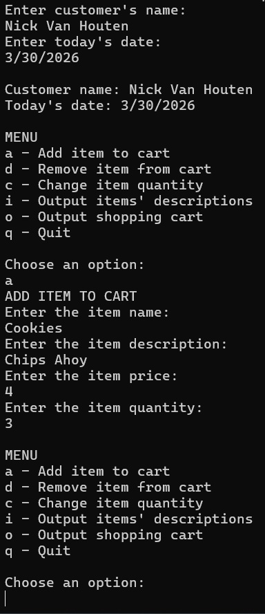

Portfolio
=========

Programming Projects
--------------------

*For access to my private project repositories, please [email me](mailto:nevanhouten@student.csuniv.edu?subject=GitHub%20Access) with the subject line, GitHub Access.

---
### [Battleship | CSCI 225](https://github.com/NickCSU/Battleship)

---
### [Shopping Cart | CSCI 325](https://github.com/NickCSU/Shopping-Cart)

---

Ethics Papers
-------------

### [Paper 1 Title](/pdf/sample_presentation.pdf)

-   **Class:**  
-   **Grade:**

### [Paper 2 Title](/pdf/sample_presentation.pdf)

-   **Class:** 
-   **Grade:**

### [Paper 3 Title](/pdf/sample_presentation.pdf)

-   **Class:** 
-   **Grade:**

---

Presentations
-------------

### [Presentation 1 Title](/pdf/sample_presentation.pdf)

- **Class:** 
- **Grade:**

### [Presentation 2 Title](/pdf/sample_presentation.pdf)

- **Class:** 
- **Grade:**

---

Page template forked from <a href="https://github.com/csu-cs/csci-portfolio">CSU-CS</a>

<!-- Remove above link if you don't want to attributive -->
