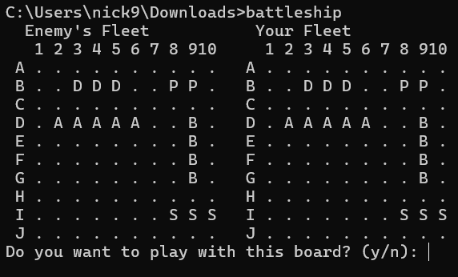
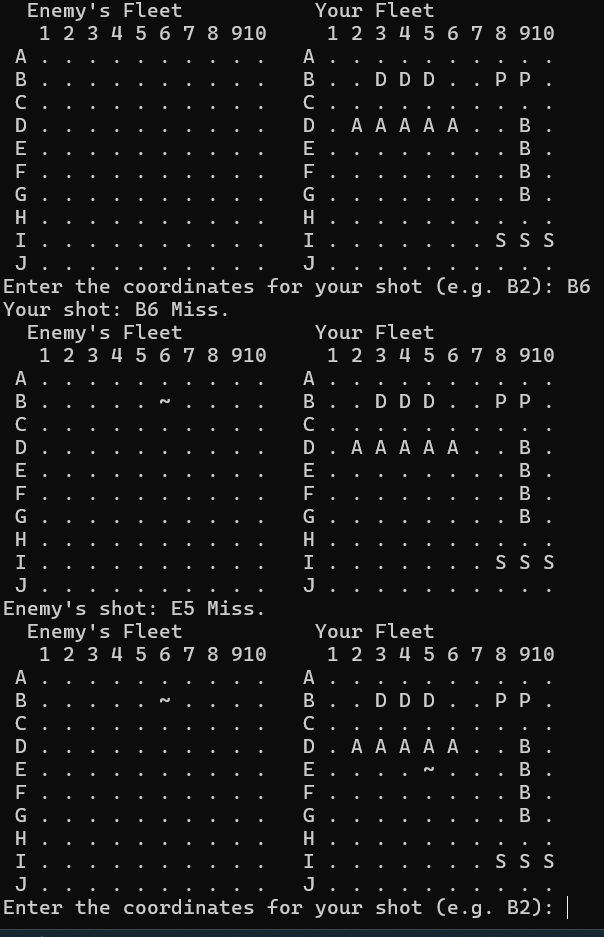

[Back to Portfolio](./)

Battleship
===============

-   **Class:** Procedural Programming
-   **Grade:** 72
-   **Language(s):** C++
-   **Source Code Repository:** [Battleship](https://github.com/NickCSU/Battleship)  
    (Please [email me](mailto:nevanhouten@student.csuniv.edu?subject=GitHub%20Access) to request access.)

## Project description

This program allows the user to play the game of battleship with the computer.

## How to compile and run the program

How to compile (if applicable) and run the project.

```
Open command prompt or a terminal.
cd downloads
compile program "g++ Battleship.cpp -o battleship"
run the program
Windows: "battleship"
Linux/Ubuntu: "./battleship"
```

If the programming language does not require compilation, the update the heading to be “How to run the program.” If your application is deployed on a remote service, including instructions on how to deploy it.

## UI Design

Once you run the program, a random board is presented and you must select y/n to choose that board (Fig 1), "n" randomly generates another board, "y" continues with the board. You will then take turns trying to sink the enemy ships (Fig 2), until someone has sunk all of the enemy ships.


  
Fig 1. Selecting board

  
Fig 2. Example output during the game.

[Back to Portfolio](./)
