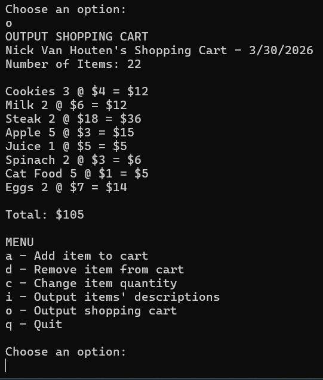

[Back to Portfolio](./)

Shopping Cart
===============

-   **Class:** Object-Oriented Programming
-   **Grade:** 100
-   **Language(s):** Java
-   **Source Code Repository:** [Shopping Cart](https://github.com/NickCSU/Shopping-Cart)  
    (Please [email me](mailto:nevanhouten@student.csuniv.edu?subject=GitHub%20Access) to request access.)

## Project description

This program works as a digital shopping cart, with the abilty to add and remove items with the ability to calculate total cost.

## How to compile and run the program

How to compile (if applicable) and run the project.

```
Windows PowerShell:
open a terminal and run "javac *.java"
then run "jar cfe ShoppingCart.jar ShoppingCartManager *.class"
then you can run the program with "java -jar ShoppingCart.jar"
```

## UI Design

The program will first ask for your name and date, then it will output the menu in which you can add, remove, change quantity, output descriptions, and output shopping cart. When adding an item, the program will ask for the name of the item, a description, the amount, and the price. (Fig 1) After completing your shopping cart, you can then ask for the total price, and then hit quit to stop the program (Fig 2).


  
Fig 1. Starting the program

  
Fig 2. Shopping cart total

## 3. Additional Considerations

This is a useful tool to predict how much you will spend at the grocery store.

[Back to Portfolio](./)
